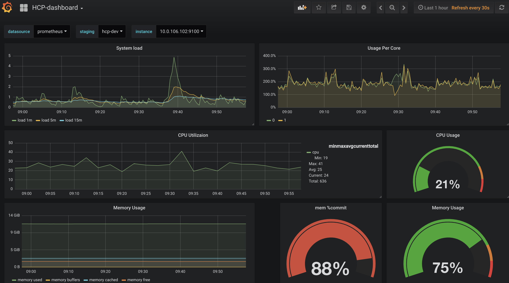

参考：

1. https://github.com/coreos/prometheus-operator
2. https://www.qikqiak.com/post/prometheus-operator-advance/


## install with helm

```bash
$ helm install \
    --name prom \
    --namespace monitoring \
    -f custom-values.yaml \
    stable/prometheus-operator

$ cat > custom-values.yaml <<EOF
# Depending on which DNS solution you have installed in your cluster enable the right exporter
coreDns:
  enabled: false

kubeDns:
  enabled: true

alertmanager:
  alertmanagerSpec:
    storage:
      volumeClaimTemplate:
        spec:
          selector:
            matchLabels:
              app: my-example-alertmanager
          resources:
            requests:
              storage: 50Gi

prometheus:
  prometheusSpec:
    storage:
      volumeClaimTemplate:
        spec:
          selector:
            matchLabels:
              app: my-example-prometheus
          resources:
            requests:
              storage: 50Gi

# 参考：https://github.com/helm/charts/blob/master/stable/grafana/README.md
grafana:
  adminPassword: "YourPass123#"
  ingress:
    enabled: true
    annotations:
      kubernetes.io/ingress.class: nginx
      kubernetes.io/tls-acme: "true"
    hosts:
      - grafana.test.akomljen.com
    tls:
      - secretName: grafana-tls
        hosts:
          - grafana.test.akomljen.com
  persistence:
    enabled: true
    accessModes: ["ReadWriteOnce"]
    size: 10Gi
EOF
```

## install

```bash
$ k apply -f manifests/
```


添加自定义node 节点：

```bash
$ vim my-external-node-exporter.yaml
- job_name: node-exporter
  static_configs:
  - targets: ['10.0.106.150:9100']
    labels:
      name: runner-local
      group: gitlab-runner
$ kubectl create secret generic additional-configs --from-file=my-external-node-exporter.yaml -n monitoring
$ vim prometheus-prometheus.yaml
// add
apiVersion: monitoring.coreos.com/v1
kind: Prometheus
spec:
  additionalScrapeConfigs:
    name: additional-configs
    key: my-external-node-exporter.yaml

# use NodePort svc type
# reload prometheus
$ curl -X POST http://10.0.106.160:9090/-/reload
```

## grafana

1. 使用configmap 自定义`grafana.ini`

```bash
$ kubectl create configmap my-grafana-config --from-file=grafana.ini -n monitoring
```

在`grafana-deployment.yaml`里面添加：

```
volumes:
- configMap:
    name: my-grafana-config
  name: my-grafana-config

volumeMounts:
- mountPath: /etc/grafana
  name: my-grafana-config
```

2. 自定义dashboard

按照不同的staging进行分组，效果如下：



导出dashboard的json，[json文件](grafana/HCP-dashboard-1546517356842.json)
